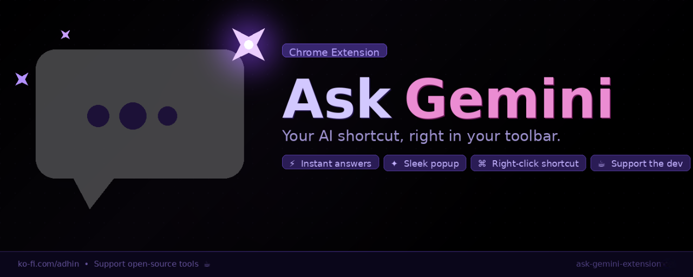

# Ask Gemini — Chrome Extension


[](https://chromewebstore.google.com/detail/ask-gemini/fjjilejcmcominckkkfboobnaplbkdfd?authuser=0&hl=en-GB)
[](https://ko-fi.com/adhin/tip)

Instantly send questions to Google Gemini right from your browser toolbar.



---

## Features

| Action | What happens |
|---|---|
| **Left-click** the extension icon | Opens the popup — type your question, press **Enter** or click **Ask** |
| **Right-click** the extension icon | Shows context menu → *Open Gemini* (goes directly, no popup) |
| **Right-click selected text** on any page | *Ask Gemini: "…"* — opens Gemini pre-filled with your selection |
| **Ko-fi button** (☕ top-right of popup) | Support the developer at ko-fi.com/adhin/tip |

---

## Installation (Developer Mode)

1. Download / unzip this folder.
2. Open Chrome and go to `chrome://extensions/`.
3. Enable **Developer mode** (toggle top-right).
4. Click **Load unpacked** and select this folder.
5. The 🔮 icon appears in your toolbar — pin it for easy access.

---

## How the message injection works

1. Your question is saved to `chrome.storage.local` along with your selected model preference.
2. Gemini opens (or an existing tab refreshes to a fresh session).
3. The content script (`content.js`) runs on `gemini.google.com`, reads the stored message and model, optionally switches the Gemini model, then injects the message into Gemini's input field and fires a submit event.

> **Note:** Gemini is a complex React SPA. If the message isn't auto-submitted on the first try (Google occasionally changes their DOM), you can still paste it manually — your question is always in your clipboard flow via storage.

---

## Files

```
ask-gemini-extension/
├── manifest.json      Chrome extension manifest (MV3)
├── popup.html         Popup UI
├── popup.css          Popup styles
├── popup.js           Popup logic
├── options.html       Settings page UI
├── options.css        Settings page styles
├── options.js         Settings page logic
├── background.js      Service worker — context menus
├── content.js         Gemini page script — message injection
└── icons/
    ├── icon16.png
    ├── icon48.png
    └── icon128.png
```

---

## Permissions used

| Permission | Why |
|---|---|
| `storage` | Stores your question and model preference to pass them to the Gemini tab, and persists settings across browser restarts |
| `contextMenus` | Adds the right-click "Open Gemini" menu items |
| `tabs` | Opens / focuses the Gemini tab |
| `scripting` | Reads the selected text on the current page to auto-fill the popup |
| `activeTab` | Required alongside `scripting` for selected-text access |
| `host_permissions: gemini.google.com` | Allows the content script to run on Gemini |
