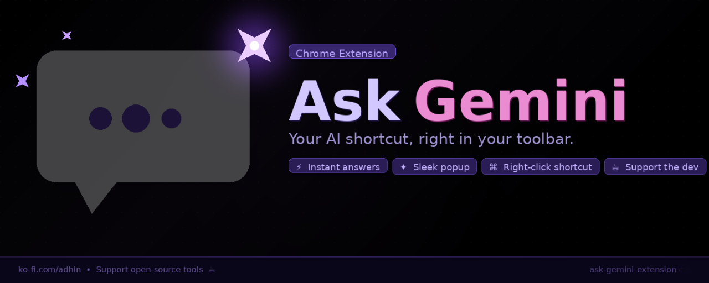
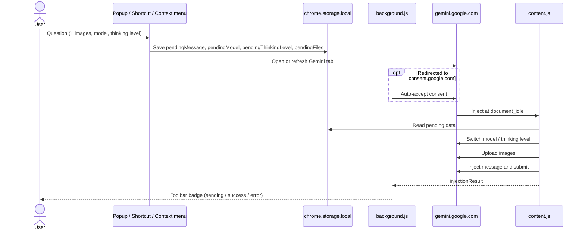
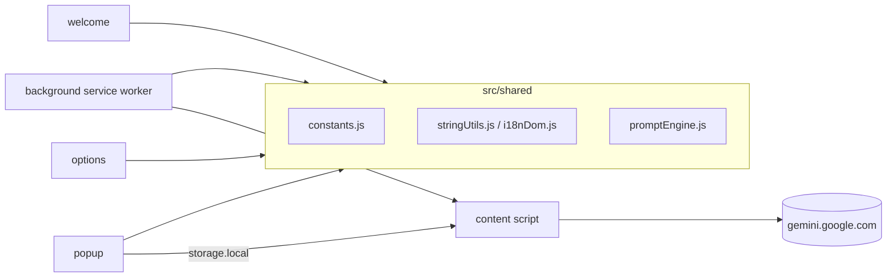

# Ask Gemini — Chrome Extension


[](https://chromewebstore.google.com/detail/ask-gemini/fjjilejcmcominckkkfboobnaplbkdfd?authuser=0&hl=en-GB)
[](https://ko-fi.com/adhin/tip)

Instantly send questions to Google Gemini right from your browser toolbar, a keyboard shortcut or the right-click menu — with model choice, image attachments and reusable prompt templates.



---

## Features

| Action | What happens |
|---|---|
| **Left-click** the extension icon (or **Ctrl+Shift+L** / **Cmd+Shift+L**) | Opens the popup — type your question, press **Enter** or click **Ask** |
| **Right-click** the extension icon or a page | Context menu → *Open Gemini* (goes directly, no popup) |
| **Right-click selected text** on any page | *Ask Gemini: "…"* — opens Gemini pre-filled with your selection |
| **Model switcher** in the popup | Choose Flash-Lite, Flash or Pro, plus a Standard / Extended thinking level |
| **Attach images** (button or drag & drop) | Images are uploaded to Gemini together with your question |
| **Templates** | Insert reusable prompts per model; manage them in Settings |
| **Settings page** | Prompt history, templates, appearance, context-menu behaviour, Prompt Engineering rules (variables like `{{selection}}`, `{{url}}`, `{{domain}}`, `{{title}}`, `{{lang}}`, `{{length}}`) and keyboard shortcut |
| **Ko-fi button** | Support the developer at ko-fi.com/adhin/tip |

The interface is available in English, German, Spanish, French and Simplified Chinese.

---

## Installation (Developer Mode)

1. Clone or download this repository.
2. Install dependencies and build the runtime bundles (Node 22+ recommended, CI uses Node 24):
   ```bash
   npm install
   npm run build
   ```
3. Open Chrome and go to `chrome://extensions/`.
4. Enable **Developer mode** (toggle top-right).
5. Click **Load unpacked** and select this folder.
6. Pin the extension icon in your toolbar for easy access.

---

## How the message injection works

1. Your question (and any attached images) is saved to `chrome.storage.local` along with your selected model and thinking level.
2. Gemini opens (or an existing tab refreshes to a fresh session).
3. The content script (`content.js`) runs on `gemini.google.com`, reads the stored message and model, optionally switches the Gemini model and thinking level, uploads attached images, then injects the message into Gemini's input field and fires a submit event.


```mermaid
sequenceDiagram
    actor User
    participant Entry as Popup / Shortcut / Context menu
    participant Storage as chrome.storage.local
    participant BG as background.js
    participant Tab as gemini.google.com
    participant CS as content.js

    User->>Entry: Question (+ images, model, thinking level)
    Entry->>Storage: Save pendingMessage, pendingModel, pendingThinkingLevel, pendingFiles
    Entry->>Tab: Open or refresh Gemini tab
    opt Redirected to consent.google.com
        BG->>Tab: Auto-accept consent
    end
    Tab->>CS: Inject at document_idle
    CS->>Storage: Read pending data
    CS->>Tab: Switch model / thinking level
    CS->>Tab: Upload images
    CS->>Tab: Inject message and submit
    CS-->>BG: injectionResult
    BG-->>User: Toolbar badge (sending / success / error)
```

> **Note:** Gemini is a complex React SPA. If the message isn't auto-submitted on the first try (Google occasionally changes their DOM), you can still paste it manually — your question is always in your clipboard flow via storage.

---

## Project layout


```mermaid
flowchart LR
    subgraph Shared["src/shared"]
        C[constants.js]
        S[stringUtils.js / i18nDom.js]
        P[promptEngine.js]
    end
    Popup[popup] --> Shared
    Options[options] --> Shared
    Welcome[welcome] --> Shared
    BG[background service worker] --> Shared
    Popup -- storage.local --> CS[content script]
    BG -- storage.local --> CS
    CS --> Gemini[(gemini.google.com)]
```

```
ask-gemini-extension/
├── manifest.json        Chrome extension manifest (MV3)
├── build.mjs            esbuild bundler (npm run build)
├── package.sh           Chrome Web Store zip (dist/ask-gemini-extension.zip)
├── _locales/            en, de, es, fr, zh_CN translations
├── icons/               Toolbar / store icons
├── src/
│   ├── background/      Service worker — context menus, shortcut, badge, migrations
│   ├── content/         Gemini page script — message / file injection
│   ├── popup/           Popup UI
│   ├── options/         Settings page
│   ├── welcome/         First-run page
│   └── shared/          Constants, i18n helpers, prompt engine, base styles
├── tests/               Vitest unit tests
└── e2e/                 Playwright end-to-end scenarios (real Gemini)
```

## Development

```bash
npm run build        # production build → src/**/*.min.{js,css}
npm run build:dev    # unminified with inline source maps
npm run lint         # ESLint + Stylelint + HTMLHint
npm test             # unit tests (Vitest)
npm run e2e          # end-to-end tests (Playwright, needs a Gemini-capable session)
```

See [CONTRIBUTING.md](CONTRIBUTING.md) for contribution guidelines.

---

## Permissions used

| Permission | Why |
|---|---|
| `storage` | Stores your question and model preference to pass them to the Gemini tab, and persists settings across browser restarts |
| `contextMenus` | Adds the right-click "Open Gemini" / "Ask Gemini" menu items |
| `tabs` | Opens / focuses the Gemini tab |
| `scripting` | Reads the selected text on the current page to auto-fill the popup |
| `activeTab` | Required alongside `scripting` for selected-text access |
| `host_permissions: gemini.google.com` | Allows the content script to run on Gemini |
| `host_permissions: consent.google.com` | Lets the extension continue past Google's cookie-consent redirect when sending a question |
